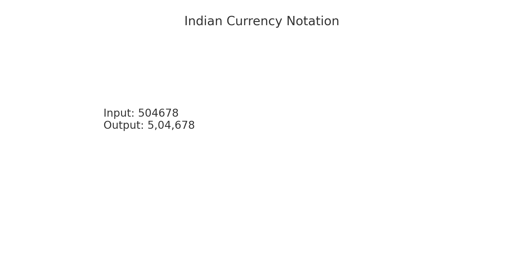
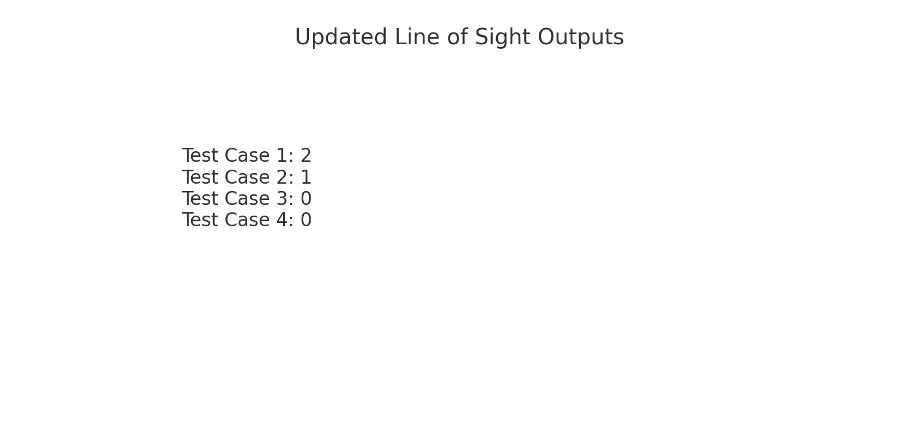

# Python Solutions for Assignment

This repository contains solutions to two Python problems: Indian Currency Notation and the Line of Sight problem.

## Problem Descriptions

### Problem 1: Indian Currency Notation
Convert an integer into Indian currency notation without using external libraries.

**Example:**
- Input: `504678`
- Output: `5,04,678`

### Problem 2: Line of Sight Problem
Determine the minimum number of players who need to be removed to allow visibility between two people in a line.

**Example:**
- Input:
Test Case 1: 4, 10, [2, 13, 4, 16] Test Case 2: 5, 8, [9, 3, 8, 8, 4]
- Output:
Test Case 1: 2 Test Case 2: 1

## How to Run
1. Clone this repository.
2. Run the Python scripts:
 - `IndianCurrencyNotation.py` for the Indian Currency problem.
 - `LineOfSight.py` for the Line of Sight problem.

## Screenshots

### Indian Currency Notation Output

### Line of Sight Output

